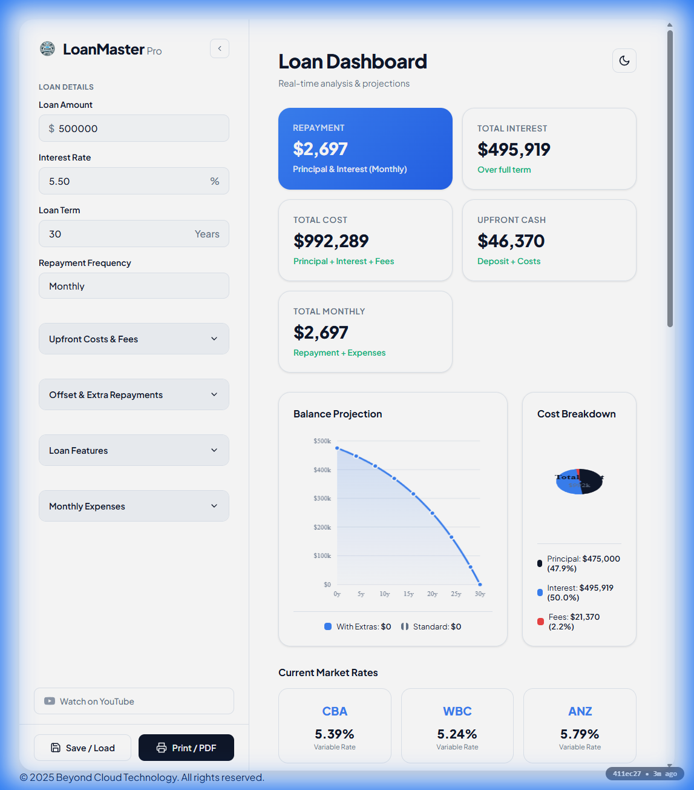
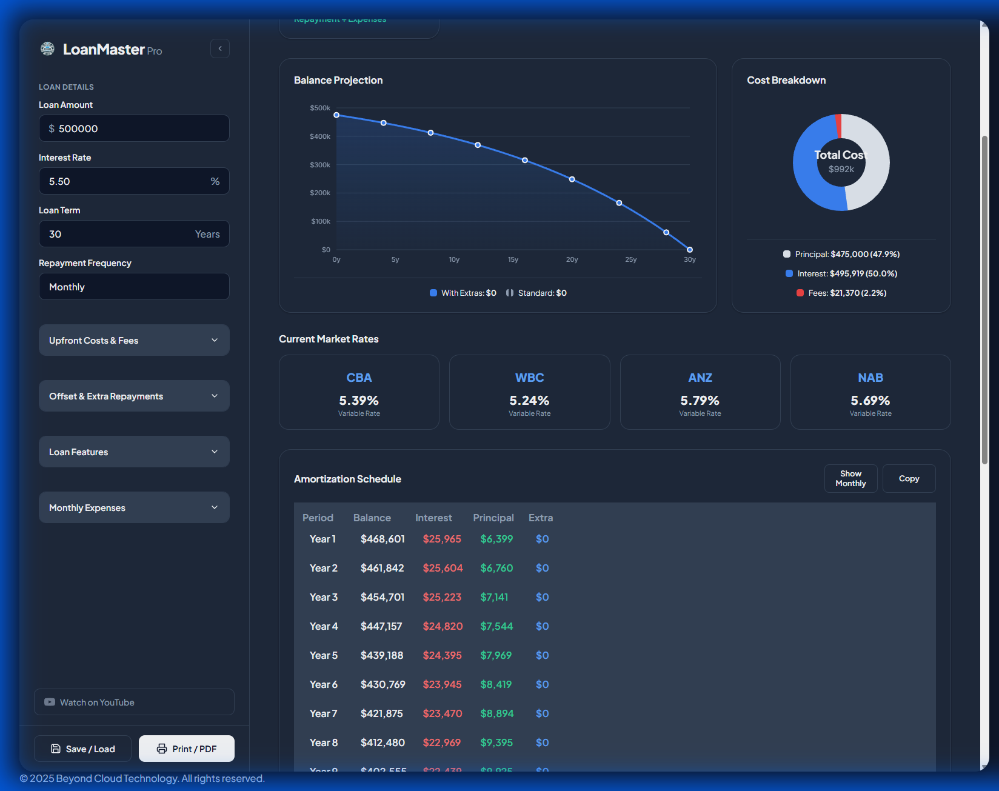
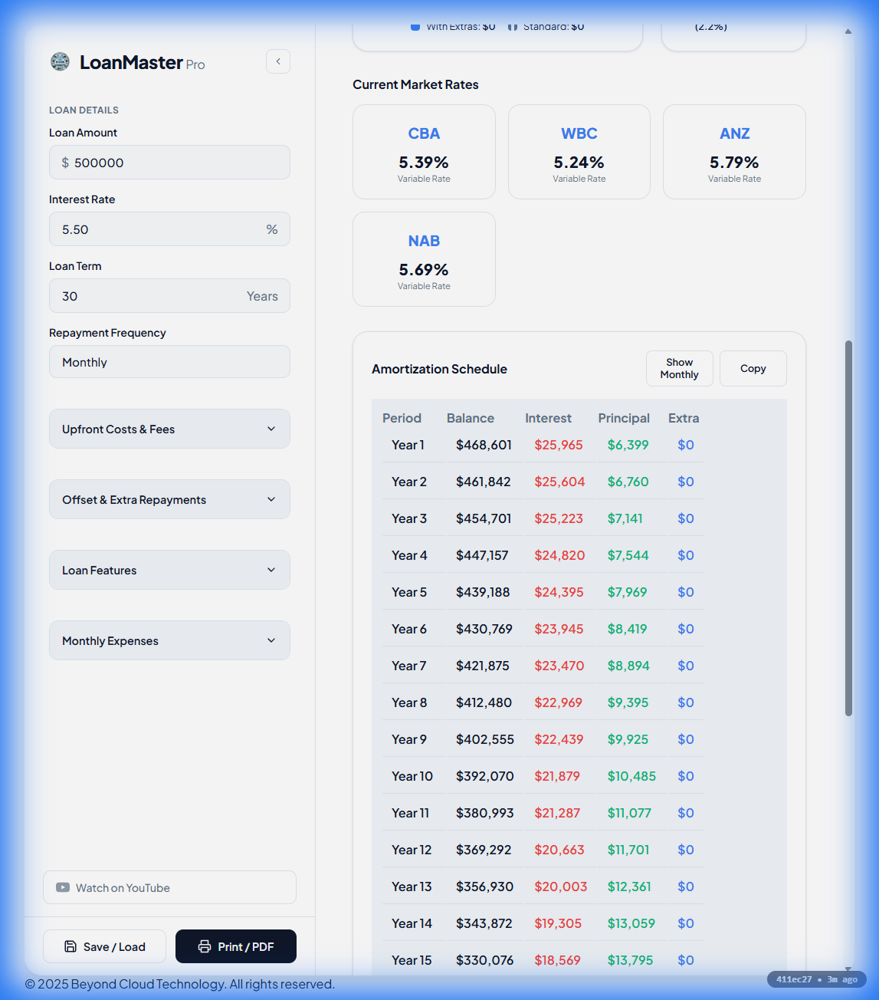
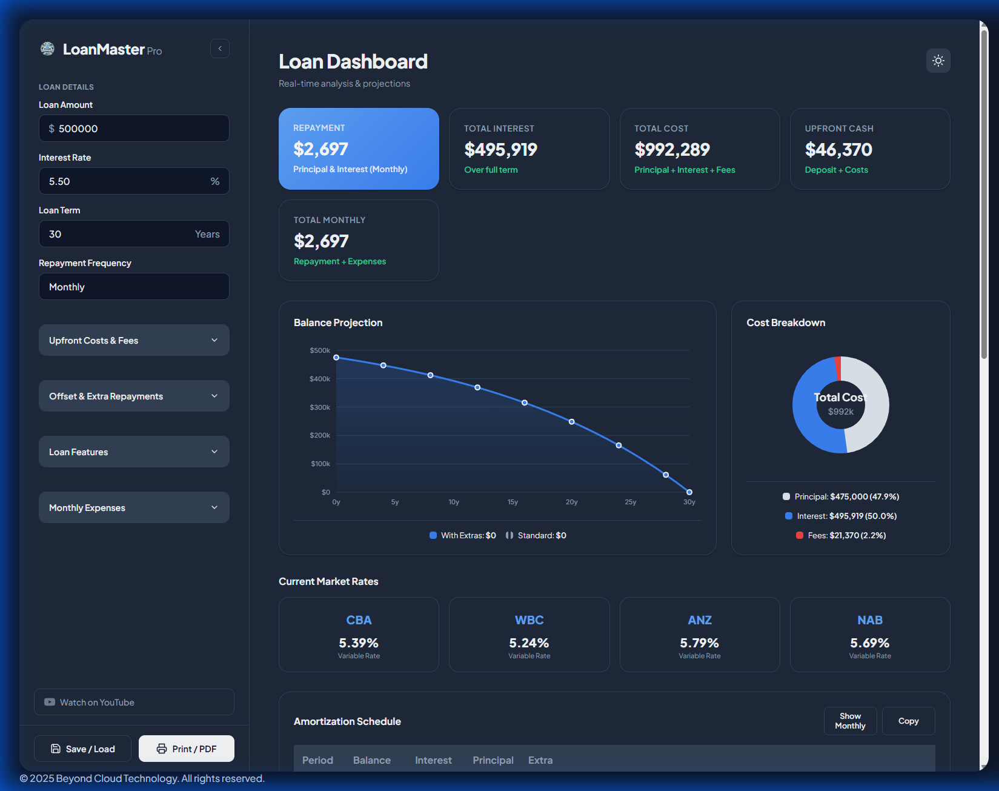
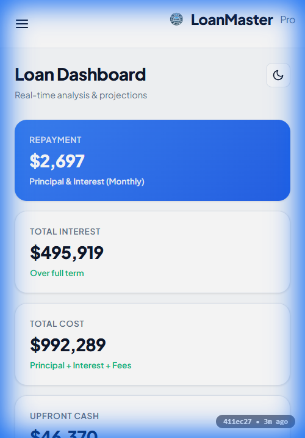

# 🏠 Australian Home Loan Calculator

**A professional, feature-rich mortgage calculator built specifically for the Australian property market.**

[](https://au-homeloan-calculator.beyondcloud.technology/)
[](LICENSE)

---

## 🌐 Live Application

**Try it now:** [https://au-homeloan-calculator.beyondcloud.technology/](https://au-homeloan-calculator.beyondcloud.technology/)

---

## 📸 Screenshots

### Desktop View


### Interactive Charts


### Amortization Schedule


### Dark Mode


### Mobile Responsive


---

## ✨ Key Features

### 💰 Comprehensive Loan Calculations
- **Flexible Repayment Frequencies**: Monthly, fortnightly, or weekly payments
- **Interest-Only Periods**: Support for IO loans (up to 5 years)
- **Offset Account Integration**: Calculate real savings from offset balances
- **Extra Repayments**: See how additional payments reduce term and interest
- **Auto-Calculated Deposit**: Set percentage, auto-updates the amount

### 📊 Advanced Financial Analysis
- **Real-Time Calculations**: Instant updates as you adjust parameters
- **Interactive Charts**: 
  - Balance projection over time (with/without extras comparison)
  - Cost breakdown (principal vs interest vs fees)
- **Detailed Amortization Schedule**: View yearly or monthly breakdowns
- **Total Cost Analysis**: Complete view of principal, interest, and all fees

### 🏦 Australian-Specific Features
- **State-by-State Stamp Duty**: Auto-calculation for all 8 states/territories
  - VIC, NSW, QLD, WA, SA, TAS, ACT, NT
- **Current Market Rates**: Live comparison from Australia's Big 4 banks
  - Commonwealth Bank (CBA)
  - Westpac (WBC)
  - ANZ
  - NAB
- **All-in-One Cost Calculator**: 
  - Deposit requirements
  - Conveyancing/legal costs
  - Stamp duty
  - LMI and other fees
  - Property insurance, strata fees, council rates

### 🎨 Modern User Experience
- **Dark/Light Theme**: Toggle for comfortable viewing
- **Fully Responsive**: Optimized for desktop, tablet, and mobile
- **Collapsible Sidebar**: Maximize screen space when needed
- **Smooth Animations**: Premium feel with micro-interactions
- **Print/PDF Export**: Generate professional reports
- **Scenario Management**: Save and compare multiple loan options

### 🔧 Technical Excellence
- **Pure Vanilla JavaScript**: No frameworks, no dependencies, blazing fast
- **Modern CSS**: Flexbox, Grid, Custom Properties
- **Offline Ready**: Works without internet once loaded
- **Git Version Tracking**: Live commit info displayed (hash + age)

---

## 🚀 Getting Started

### Option 1: Use the Live App
Simply visit [https://au-homeloan-calculator.beyondcloud.technology/](https://au-homeloan-calculator.beyondcloud.technology/)

### Option 2: Run Locally

1. Clone the repository:
```bash
git clone https://github.com/DeNNiiInc/AU-HomeLoan-Calculator.git
cd AU-HomeLoan-Calculator
```

2. Open `index.html` in your browser:
```bash
# Windows
start index.html

# macOS
open index.html

# Linux
xdg-open index.html
```

That's it! No build process or dependencies required.

---

## 📖 How to Use

### Basic Loan Calculation

1. **Enter Your Loan Details**:
   - **Loan Amount**: The total amount you wish to borrow
   - **Interest Rate**: Annual interest rate (%)
   - **Loan Term**: Duration in years
   - **Repayment Frequency**: Choose monthly, fortnightly, or weekly

2. **View Your Results**:
   - Repayment amount displayed prominently
   - Total interest and total cost calculated automatically
   - Interactive charts show balance projection over time

### Advanced Features

#### Upfront Costs & Fees
Expand the "Upfront Costs & Fees" section to configure:
- **Deposit Percentage**: Auto-calculates deposit amount
- **State/Territory**: Select for accurate stamp duty calculation
- **Auto-Calculate Stamp Duty**: Toggle on/off for manual override
- **Conveyancing/Legal Costs**: Add professional fees
- **LMI / Other Fees**: Include lender's mortgage insurance
- **Introductory Fees**: Application and settlement costs

#### Offset & Extra Repayments
- **Offset Account Balance**: Enter your offset balance to see interest savings
- **Extra Repayment**: Add per-payment extras to pay off faster
- Charts automatically update to show time/money saved

#### Interest-Only Period
- Toggle the IO period on/off
- Set duration (1-5 years)
- See how it affects your repayments and total interest

#### Monthly Expenses
Track all property-related expenses:
- Property insurance
- HOA/Strata fees
- Council rates
- Other monthly costs

View your **Total Monthly Outgoings** including loan repayment + all expenses.

### Save & Compare Scenarios

1. Click **Save / Load** button
2. Enter a scenario name (e.g., "Bank A Offer")
3. Click **Save** to store current settings
4. Load saved scenarios to compare different loan options side-by-side

---

## 🏗️ Project Structure

```
AU-HomeLoan-Calculator/
├── index.html              # Main HTML structure
├── styles.css              # Styling and themes
├── script.js               # Calculator logic and interactivity
├── version.js              # Git version info (auto-generated)
├── update_version.sh       # Script to update version info
├── update_version.ps1      # PowerShell version updater
├── deploy.sh               # Auto-deployment script
├── package.json            # Node.js configuration
├── Logo.png                # BCT branding logo
├── screenshots/            # Application screenshots
├── LICENSE                 # GPL-3.0 license
└── README.md               # This file
```

---

## 🔧  Technical Details

- **Pure Vanilla JavaScript**: No frameworks or dependencies
- **Modern CSS**: Flexbox, Grid, Custom Properties, smooth transitions
- **Responsive Design**: Mobile-first approach with desktop enhancements
- **Local Storage**: Scenarios saved in browser for persistence
- **Print Optimized**: Clean CSS for PDF generation
- **Auto-Deployment**: PM2 + Cron-based CI/CD to Proxmox server
- **Version Tracking**: Automated git commit hash + age display

---

## 📱 Browser Support

- ✅ Chrome/Edge (latest)
- ✅ Firefox (latest)
- ✅ Safari (latest)
- ✅ Mobile browsers (iOS Safari, Chrome Mobile)

---

## 🤝 Contributing

Contributions are welcome! Please feel free to submit a Pull Request.

1. Fork the project
2. Create your feature branch (`git checkout -b feature/AmazingFeature`)
3. Commit your changes (`git commit -m 'Add some AmazingFeature'`)
4. Push to the branch (`git push origin feature/AmazingFeature`)
5. Open a Pull Request

---

## 📄 License

This project is licensed under the GPL-3.0 License - see the [LICENSE](LICENSE) file for details.

---

## 🎥 About Beyond Cloud Technology

This calculator is developed and maintained by **Beyond Cloud Technology**.

- 🌐 Website: [beyondcloud.technology](https://beyondcloud.technology)
- 📺 YouTube: [@beyondcloudtechnology](https://www.youtube.com/@beyondcloudtechnology)

---

## ⚠️ Disclaimer

This calculator is for **informational purposes only** and should **not** be considered financial advice. Always consult with a qualified financial advisor or mortgage broker before making loan decisions. Interest rates and fees shown are indicative and may not reflect current market rates.

---

## 🙏 Acknowledgments

- Bank logos provided by [Clearbit](https://clearbit.com)
- Icons from [Feather Icons](https://feathericons.com)
- Fonts from [Google Fonts](https://fonts.google.com)

---

**Made with ❤️ by Beyond Cloud Technology**

© 2025 Beyond Cloud Technology. All rights reserved.
